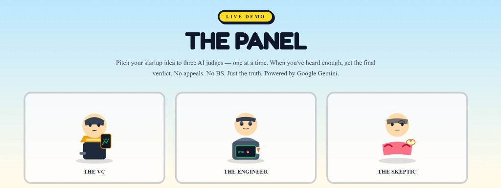

# The Panel

**Pitch your startup idea to three AI judges — one at a time. When you've heard enough, get the final verdict.**

A live demo web app where three distinct AI personas critique your startup idea: a VC obsessed with TAM, a battle-scarred staff engineer, and a skeptical regular person who asks if your mum would actually use it.



---

## How it works

1. **Meet the judges** — Hover (or tap on mobile) over each cartoon judge to see who they are and what they'll grill you on.
2. **Submit your idea** — Paste a startup pitch or pick an example chip.
3. **Choose your judge** — Ask the VC, Engineer, or Skeptic one at a time. Each streams their critique live.
4. **Get the verdict** — After hearing from at least two judges, bang the gavel for a two-sentence final word. No appeals.

---

## Features

- **Three AI personas** with distinct voices, system prompts, and judging criteria
- **Streaming critiques** — responses appear token-by-token via the Vercel AI SDK
- **Game-show UI** — bright cartoon SVG characters, persona-themed speech bubbles, and a spotlight on the active judge
- **Interactive judge intros** — z-axis overlay on hover reveals each judge's backstory and checklist
- **Verdict synthesis** — combines heard critiques into a short, punchy final ruling

---

## Tech stack

| Layer | Tools |
| --- | --- |
| Framework | [Next.js 16](https://nextjs.org) (App Router) |
| AI | [Google Gemini](https://ai.google.dev/) via [`@ai-sdk/google`](https://sdk.vercel.ai) |
| Streaming | [`ai`](https://sdk.vercel.ai) + [`@ai-sdk/react`](https://sdk.vercel.ai/docs/ai-sdk-ui) (`useCompletion`) |
| UI | [Tailwind CSS 4](https://tailwindcss.com), [shadcn/ui](https://ui.shadcn.com), custom SVG characters |
| Validation | [Zod 4](https://zod.dev) |
| Lint / format | [Biome](https://biomejs.dev) |

---

## Quick start

### Prerequisites

- [Bun](https://bun.sh) or Node.js 20+
- A [Google AI Studio API key](https://aistudio.google.com/apikey)

### 1. Clone and install

```bash
git clone <your-repo-url>
cd the-panel
bun install
```

### 2. Configure environment

```bash
cp .env.example .env
```

Add your API key to `.env`:

```env
GOOGLE_GENERATIVE_AI_API_KEY=your-key-here
```

Optional:

```env
# Alias — also supported
GOOGLE_API_KEY=your-key-here

# Default: gemini-2.5-flash
AI_MODEL=gemini-2.5-flash
```

### 3. Run locally

```bash
bun dev
```

Open [http://localhost:3000](http://localhost:3000).

---

## Scripts

| Command | Description |
| --- | --- |
| `bun dev` | Start the development server |
| `bun run build` | Production build |
| `bun start` | Run the production server |
| `bun run lint` | Lint with Biome |
| `bun run format` | Format with Biome |

---

## Project structure

```
the-panel/
├── docs/
│   └── screenshot.png          # README hero image
├── src/
│   ├── app/
│   │   ├── api/
│   │   │   ├── critique/       # POST — stream a persona critique
│   │   │   └── verdict/        # POST — stream the final verdict
│   │   ├── layout.tsx
│   │   └── page.tsx
│   ├── components/
│   │   ├── characters/         # SVG judge avatars
│   │   ├── meet-the-judges.tsx # Hover intro overlay
│   │   ├── persona-booth.tsx   # Active judging UI
│   │   ├── the-panel.tsx       # Main orchestrator
│   │   └── verdict-card.tsx
│   └── lib/
│       ├── model.ts            # Gemini client & generation options
│       ├── personas.ts         # Judge definitions & prompts
│       ├── schemas.ts          # Zod request/response schemas
│       └── verdict-prompt.ts
└── .env.example
```

---

## API routes

### `POST /api/critique`

Streams a critique from one judge.

```json
{
  "prompt": "AI that writes your mum's texts",
  "personaId": "vc"
}
```

`personaId` is one of: `vc`, `engineer`, `skeptic`.

### `POST /api/verdict`

Streams the final verdict after at least two critiques.

```json
{
  "idea": "AI that writes your mum's texts",
  "critiques": {
    "vc": "...",
    "engineer": "..."
  }
}
```

---

## The judges

| Judge | Looks for |
| --- | --- |
| **The VC** | Market size, monetization, unit economics, moat |
| **The Engineer** | Feasibility, scalability, ops burden, edge cases |
| **The Skeptic** | Real user problem, jargon call-outs, would normal people care? |

Persona prompts and metadata live in [`src/lib/personas.ts`](./src/lib/personas.ts).

---

## Deploy

Works on [Vercel](https://vercel.com) or any Node.js host. Set `GOOGLE_GENERATIVE_AI_API_KEY` (or `GOOGLE_API_KEY`) in your deployment environment.

```bash
bun run build
bun start
```

---

## License

Private / demo project — adjust as needed for your repo.
